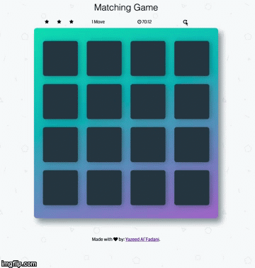

# Memory Game Project V1.0

## Table of Contents

* [General](#general)
* [How The Game Works](#how-the-game-works)
* [Resources](#resources)

## General 

Udacity Front-End Developer Nanodegree Second Project

* Try It Out https://YR3.github.io/classical-memory-game/ 

* Game overview 

## How The Game Works

The game board consists of sixteen "cards" arranged in a grid. The deck is made up of eight different pairs of cards, each with 
different symbols on one side. The cards are arranged randomly on the grid with the symbol face down. The gameplay rules are very
simple: open two hidden cards at a time to locate the ones that match!

Each turn:

* The player opens one card over to reveal its underlying symbol.
* The player then opens a second card, trying to find the corresponding card with the same symbol and that will be counted as one move.
* If the cards match, both cards stay opened.
* If the cards do not match, both cards are closed again.

The stars rating depends on the number of moves:
*  :star::star::star: If the moves  are less than 16.
* :star::star: If the moves  are less than 24.
* :star: If the moves  are less than 26.
* :sad: If the move are more than 27

The game ends once all cards have been correctly matched.
The player could restart the game at any time by clicking on the restart icon.

## Resources

* Shuffle function from [stackoverflow](http://stackoverflow.com/a/2450976).
* Icons from Font [fontawesome](https://fontawesome.com/v4.7.0/icons/) - [cdn](https://maxcdn.bootstrapcdn.com/font-awesome/4.6.1/css/font-awesome.min.css).
* Shake animation from [w3schools](https://www.w3schools.com/howto/howto_css_shake_image.asp).
